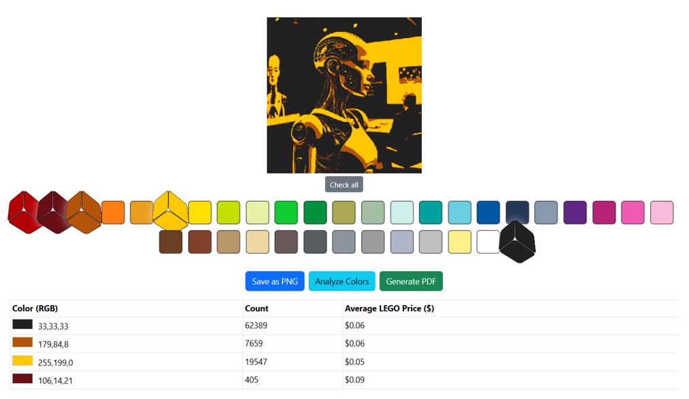
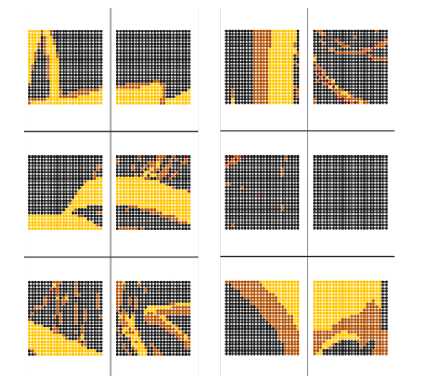

# 🎨 Fullstack Web Application for Image Processing and Data-Driven Instruction Generation


Developed as an engineering thesis project, this application demonstrates comprehensive fullstack development skills, including **image processing, REST API integration, user authentication, and dynamic PDF generation**. The system allows users to upload images, processes them into a simplified pixel representation suitable for modular reconstruction, estimates material requirements and costs based on real-world market data, and generates detailed step-by-step instructions in PDF format.

## Key Technologies and Skills
- **Languages & Frameworks:** JavaScript, Node.js, Express, React
- **Database:** MongoDB
- **API & Integration:** REST APIs, asynchronous processing
- **Other Skills:** Image processing, dynamic PDF generation, user authentication
---

# 🚀 Features

## 🖼 Image to LEGO Pixel Art Conversion

- Image upload and processing
- Adjustable grid dimensions (width & height)
- Pixelation using HTML5 Canvas
- Disabled image smoothing for block-style effect
- Color quantization mapped to real LEGO color palette
- Manual palette selection
- Live pixel preview


---

## 💰 Cost Estimation Based on Market Data

The backend analyzes the generated pixel art and:

- Counts occurrences of each color
- Maps RGB values to LEGO color IDs
- Fetches average market price for LEGO part **3024 (1x1 plate)** from BrickLink
- Calculates estimated total cost of the project

BrickLink API authentication is implemented using:
- OAuth 1.0a
- HMAC-SHA1 signature

The frontend displays:
- RGB color
- Required quantity
- Average price per piece
- Estimated total cost



---

## 📄 Automatic PDF Building Instructions

The application generates a downloadable PDF file containing:

- Grid-based building layout
- Multi-page support for large projects
- Visual LEGO-style stud rendering (colored circles)
- Proper A4 formatting
- Automatic file download in the browser


---

## 🔐 Authentication System

The REST API supports:

- User registration
- Login
- Logout
- Profile retrieval

Security mechanisms:

- Password hashing with bcrypt
- JWT-based authentication
- Token verification middleware
- Token stored in localStorage on the client side

---

# 🏗 System Architecture

## Frontend

Built with:

- React
- JavaScript (ES6+)
- HTML5 Canvas API
- Bootstrap
- CSS Modules

Architecture principles:

- Component-based structure
- Unidirectional data flow
- Separation of concerns
- MVC-inspired structure (View layer separation)

### Main Components

- **Workbench** – application coordinator
- **PixelCanvas**
- **ColorPalette**
- **PixelDimensions**
- **ImageUploader**
- **AnalysisTable**

Image processing logic is encapsulated inside a dedicated: `PixelArtProcessor`

## Backend

Built with:

- Node.js
- Express.js
- MongoDB
- Mongoose
- MVC architectural pattern
- RESTful API design

---

# 🗄 Database

The project uses:

- MongoDB
- Mongoose

## User Model

Fields:

- `email` (unique, validated)
- `password` (hashed)
- `createdAt`

Validation is implemented on:

- Schema level (Mongoose validation)
- Application logic level (custom email validator)

---

# 🧠 Core Algorithms

## 🎨 Color Matching

- Euclidean distance calculation in RGB color space
- Selection of closest LEGO palette color

## 🖼 Image Analysis

- RGBA buffer iteration
- RGB → LEGO color ID mapping
- Aggregation of piece counts

## 📄 PDF Rendering

- Raw pixel buffer reading
- Grid-based layout rendering
- Centered drawing logic
- Dynamic page generation

---

# 🛠 Tech Stack

## Frontend

- React
- JavaScript (ES6+)
- HTML5 Canvas API
- Bootstrap
- CSS Modules

## Backend

- Node.js
- Express
- MongoDB
- Mongoose
- bcryptjs
- jsonwebtoken
- sharp
- pngjs
- pdfkit
- oauth-1.0a

---

# ⚙️ How to Run Locally

## 1️⃣ Clone the Repository

```bash
git clone https://github.com/krudy/Brixel_app_v2.git
```

## 2️⃣ Backend Setup

Navigate to the backend directory:

```bash
cd brixel_app_backend
npm install
```
Create a `.env` file inside the `backend` folder:

```env
PORT=5000
MONGO_URI=your_mongodb_connection_string
JWT_SECRET=your_jwt_secret_key

BRICKLINK_CONSUMER_KEY=your_key
BRICKLINK_CONSUMER_SECRET=your_secret
BRICKLINK_TOKEN=your_token
BRICKLINK_TOKEN_SECRET=your_token_secret
```

Start the backend server:

```bash
npm start
```

The server should now be running at: http://localhost:5000

## 3️⃣ Frontend Setup

Open a new terminal window and navigate to the frontend directory:

```bash
cd brixel_app_frontend
npm install
npm start
```

The application should now be running at: http://localhost:3000


## 4️⃣ MongoDB Configuration

Make sure that you have one of the following set up:

- **Local MongoDB instance** running on your machine  
  OR  
- **MongoDB Atlas** (cloud database) and properly configured the `MONGO_URI` environment variable in your `.env` file:
